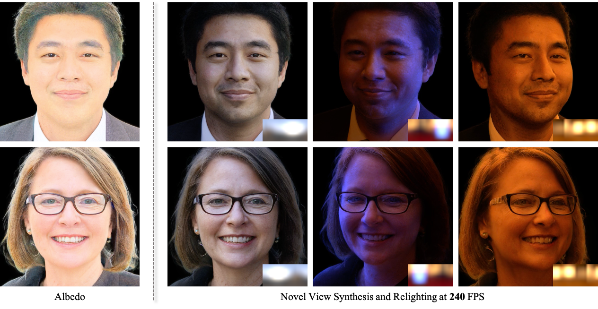

# [SIGGRAPH 2025] GSHeadRelight: Fast Relightability for 3D Gaussian Head Synthesis 

<a href="http://www.geometrylearning.com/GSHeadRelight" target="_blank">[Project page]</a>
<a href="https://dl.acm.org/doi/10.1145/3721238.3730614" target="_blank">[Paper]</a>

Official pytorch implementation for "GSHeadRelight: Fast Relightability for 3D Gaussian Head Synthesis".

For jittor implementation please see (https://github.com/IGLICT/GSHeadRelight_jittor).


### Update logs
- (25/08/14) Release inference/training code and pretrained checkpoint (https://drive.google.com/file/d/1ZCLThyUj73Je-Set6yHc7L_-IbindzJm).

## Environment setting
We build our code on GSGAN (https://github.com/hse1032/GSGAN).
Run below code snippet for installing dependencies.

```
conda env create -f environment.yml
conda activate gsheadrelight

git clone --recursive https://github.com/ashawkey/diff-gaussian-rasterization
pip install ./diff-gaussian-rasterization
imageio_download_bin freeimage
```

## Pretrained checkpoint
Pretrained checkpoint is available in Google Drive link (https://drive.google.com/file/d/1ZCLThyUj73Je-Set6yHc7L_-IbindzJm).
Please download it and put it in models/network-snapshot.pkl.


## Data preprocessing
We exactly follow the data-preprocessing of EG3D, so please refer to them (https://github.com/NVlabs/eg3d).


## Training
We provide the training script in "_scripts/train_{dataset}.sh" file.
Only need to change is the "dataset_path" variable.
Training results are saved at "outdir" directory.
```
sh _script/train_ffhq512.sh     # training on FFHQ512
```


## Evaluation
We provide the evaluation of FID.
Set the path of "network_pkl" in "_scripts/eval.sh" file properly, and run it. \
Or you can simply run below code for evaluation.

```
python calc_metrics.py --metrics=fid50k_full --network=${network_pkl}
```


## Generating media
We provide three scripts for generating videos. \
The first one is for generating videos of renderings with spherical harmonics lighting. 
```
sh _script/generate_videos_sh.sh     # generate videos with environment map
```
The second one is for generating videos of renderings with environment map. 
```
sh _script/generate_videos_envmap.sh     # generate videos with environment map
```
The third one is for generating videos of albedo.
```
sh _script/generate_videos_albedo.sh     # generate videos of albedo
```

Set the path of "network_pkl" in "_scripts/generate_videos_*.sh" file properly.


## Acknowledgement
Our code is based on the following repositories. \
GSGAN (https://github.com/hse1032/GSGAN)
EG3D (https://github.com/NVlabs/eg3d) \
Gaussian-Splatting (https://github.com/graphdeco-inria/gaussian-splatting) \
dreamgaussian (https://github.com/dreamgaussian/dreamgaussian) \

## Contact
For any further questions, please contact lvhenglei22s@ict.ac.cn

## Citation
If our paper or codebase is useful in your research, please cite our paper!
```
@inproceedings{lv2025gsheadrelight,
  title={GSHeadRelight: Fast relightability for 3D gaussian head synthesis},
  author={Lv, Henglei and Deng, Bailin and Guo, Jianzhu and Liu, Xiaoqiang and Wan, Pengfei and Zhang, Di and Gao, Lin},
  booktitle={Proceedings of the Special Interest Group on Computer Graphics and Interactive Techniques Conference Conference Papers},
  pages={1--12},
  year={2025}
}
```
